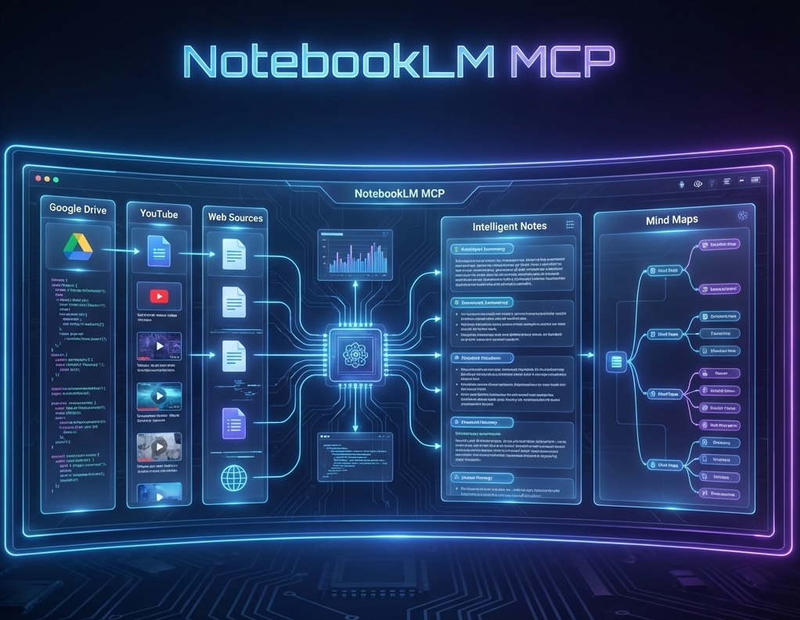

# NotebookLM MCP Server



An MCP server for **NotebookLM** (notebooklm.google.com).

> **Note:** Tested with Pro/free tier accounts. May work with NotebookLM Enterprise accounts but has not been tested.

📺 **Watch the Demos**

| **General Overview** | **Claude Desktop** | **Perplexity Desktop** | **MCP Super Assistant** |
|:---:|:---:|:---:|:---:|
| [](https://www.youtube.com/watch?v=d-PZDQlO4m4) | [](https://www.youtube.com/watch?v=PU8JhgLPxes) | [](https://www.youtube.com/watch?v=BCKlDNg-qxs) | [](https://www.youtube.com/watch?v=7aHDbkr-l_E) |


## Features

| Tool | Description |
|------|-------------|
| `notebook_list` | List all notebooks |
| `notebook_create` | Create a new notebook |
| `notebook_get` | Get notebook details with sources |
| `notebook_describe` | Get AI-generated summary of notebook content |
| `source_describe` | Get AI-generated summary and keywords for a source |
| `source_get_content` | Get raw text content from a source (no AI processing) |
| `notebook_rename` | Rename a notebook |
| `chat_configure` | Configure chat goal/style and response length |
| `notebook_delete` | Delete a notebook (requires confirmation) |
| `notebook_add_url` | Add URL/YouTube as source |
| `notebook_add_text` | Add pasted text as source |
| `notebook_add_drive` | Add Google Drive document as source |
| `notebook_query` | Ask questions and get AI answers |
| `source_list_drive` | List sources with freshness status |
| `source_sync_drive` | Sync stale Drive sources (requires confirmation) |
| `source_delete` | Delete a source from notebook (requires confirmation) |
| `research_start` | Start Web or Drive research to discover sources |
| `research_status` | Poll research progress with built-in wait |
| `research_import` | Import discovered sources into notebook |
| `audio_overview_create` | Generate audio podcasts (requires confirmation) |
| `video_overview_create` | Generate video overviews (requires confirmation) |
| `infographic_create` | Generate infographics (requires confirmation) |
| `slide_deck_create` | Generate slide decks (requires confirmation) |
| `studio_status` | Check studio artifact generation status |
| `studio_delete` | Delete studio artifacts (requires confirmation) |
| `refresh_auth` | Reload auth tokens from disk or run headless re-auth |
| `save_auth_tokens` | Save cookies for authentication |

## Important Disclaimer

This MCP uses **internal APIs** that:
- Are undocumented and may change without notice
- Require cookie extraction from your browser (I have a tool for that!)

Use at your own risk for personal/experimental purposes.

## Installation

Install from PyPI using your preferred Python package manager:

### Using uv (Recommended)
```bash
uv tool install notebooklm-mcp-server
```

### Using pip
```bash
pip install notebooklm-mcp-server
```

### Using pipx
```bash
pipx install notebooklm-mcp-server
```

<details>
<summary>Alternative: Install from Source</summary>

```bash
# Clone the repository
git clone https://github.com/jacob-bd/notebooklm-mcp.git
cd notebooklm-mcp

# Install with uv
uv tool install .
```
</details>

## Upgrading

```bash
# Using uv
uv tool upgrade notebooklm-mcp-server

# Using pip
pip install --upgrade notebooklm-mcp-server

# Using pipx
pipx upgrade notebooklm-mcp-server
```

After upgrading, restart your AI tool to reconnect to the updated MCP server:

- **Claude Code:** Restart the application, or use `/mcp` to reconnect
- **Cursor:** Restart the application
- **Gemini CLI:** Restart the CLI session

## Uninstalling

To completely remove the MCP:

```bash
# Using uv
uv tool uninstall notebooklm-mcp-server

# Using pip
pip uninstall notebooklm-mcp-server

# Using pipx
pipx uninstall notebooklm-mcp-server

# Remove cached auth tokens (optional)
rm -rf ~/.notebooklm-mcp
```

Also remove from your AI tools:

| Tool | Command |
|------|---------|
| Claude Code | `claude mcp remove notebooklm-mcp` |
| Gemini CLI | `gemini mcp remove notebooklm-mcp` |
| Cursor/VS Code | Remove entry from `~/.cursor/mcp.json` or `~/.vscode/mcp.json` |

## Authentication

Before using the MCP, you need to authenticate with NotebookLM. Run:

```bash
# Recommended: Auto mode (launches Chrome, you log in)
notebooklm-mcp-auth

# Alternative: File mode (manual cookie extraction)
notebooklm-mcp-auth --file
```

**Auto mode** launches a dedicated Chrome profile, you log in to Google, and cookies are extracted automatically. Your login persists for future auth refreshes.

**File mode** shows instructions for manually extracting cookies from Chrome DevTools and saving them to a file.

After successful auth, add the MCP to your AI tool and restart.

For detailed instructions, troubleshooting, and how the authentication system works, see **[docs/AUTHENTICATION.md](docs/AUTHENTICATION.md)**.

## MCP Configuration

> **⚠️ Context Window Warning:** This MCP provides **31 tools** which consume a significant portion of your context window. It's recommended to **disable the MCP when not actively using NotebookLM** to preserve context for your other work. In Claude Code, use `@notebooklm-mcp` to toggle it on/off, or use `/mcp` command.

> **⚠️ Context Window Warning:** This MCP provides **31 tools** which consume a significant portion of your context window. It's recommended to **disable the MCP when not actively using NotebookLM** to preserve context for your other work. In Claude Code, use `@notebooklm-mcp` to toggle it on/off, or use `/mcp` command.
 
### CLI Options

You can configure the server using command-line arguments:

| Flag | Description | Default |
|------|-------------|---------|
| `--transport`, `-t` | Transport protocol (`stdio`, `http`, `sse`) | `stdio` |
| `--port`, `-p` | Port for HTTP/SSE transport | `8000` |
| `--host`, `-H` | Host to bind for HTTP/SSE | `127.0.0.1` |
| `--debug` | Enable verbose logging (API requests/responses) | `False` |
| `--query-timeout` | Timeout for queries in seconds | `120.0` |

### Environment Variables

Alternatively, use environment variables:

| Variable | Description |
|----------|-------------|
| `NOTEBOOKLM_MCP_TRANSPORT` | Transport type (`stdio`, `http`, `sse`) |
| `NOTEBOOKLM_MCP_PORT` | Port to listen on |
| `NOTEBOOKLM_MCP_HOST` | Host to bind |
| `NOTEBOOKLM_MCP_DEBUG` | `true` to enable debug logging |
| `NOTEBOOKLM_QUERY_TIMEOUT` | Query timeout in seconds |

### HTTP Support (Open WebUI)
Run as an HTTP server for remote access or multi-user setups:
```bash
notebooklm-mcp --transport http --port 8000
```
> See **[docs/MULTI_USER_ANALYSIS.md](docs/MULTI_USER_ANALYSIS.md)** for detailed multi-user deployment guides.

### Claude Code (Recommended CLI Method)

Use the built-in CLI command to add the MCP server:

**Add for all projects (recommended):**
```bash
claude mcp add --scope user notebooklm-mcp notebooklm-mcp
```

**Or add for current project only:**
```bash
claude mcp add notebooklm-mcp notebooklm-mcp
```

That's it! Restart Claude Code to use the MCP tools.

**Verify installation:**
```bash
claude mcp list
```

<details>
<summary>Alternative: Manual JSON Configuration</summary>

If you prefer to edit the config file manually, add to `~/.claude.json`:

```json
{
  "mcpServers": {
    "notebooklm-mcp": {
      "command": "notebooklm-mcp"
    }
  }
}
```

Restart Claude Code after editing.
</details>

### Cursor, VS Code, Claude Desktop & Other IDEs

For tools that use JSON configuration files:

| Tool | Config File Location |
|------|---------------------|
| Cursor | `~/.cursor/mcp.json` |
| VS Code | `~/.vscode/mcp.json` |
| Claude Desktop | `~/Library/Application Support/Claude/claude_desktop_config.json` (macOS) |

**Step 1:** Find your installed path:
```bash
which notebooklm-mcp
```

This typically returns `/Users/<YOUR_USERNAME>/.local/bin/notebooklm-mcp` on macOS.

**Step 2:** Add this configuration (replace the path with your result from Step 1):
```json
{
  "mcpServers": {
    "notebooklm-mcp": {
      "command": "/Users/<YOUR_USERNAME>/.local/bin/notebooklm-mcp"
    }
  }
}
```

Restart the application after adding the configuration.

### Other MCP-Compatible Tools

**CLI tools with built-in MCP commands** (AIDER, Codex, OpenCode, etc.):
```bash
<your-tool> mcp add notebooklm-mcp notebooklm-mcp
```

**Tools using JSON config files** — use the full path approach shown above.

### Gemini CLI (Recommended CLI Method)

Use the built-in CLI command to add the MCP server:

**Add for all projects (recommended):**
```bash
gemini mcp add --scope user notebooklm-mcp notebooklm-mcp
```

**Or add for current project only:**
```bash
gemini mcp add notebooklm-mcp notebooklm-mcp
```

That's it! Restart Gemini CLI to use the MCP tools.

**Verify installation:**
```bash
gemini mcp list
```

<details>
<summary>Alternative: Manual JSON Configuration</summary>

Add to `~/.gemini/settings.json` under `mcpServers` (run `which notebooklm-mcp` to find your path):
```json
"notebooklm-mcp": {
  "command": "/Users/<YOUR_USERNAME>/.local/bin/notebooklm-mcp"
}
```

Restart Gemini CLI after editing.
</details>

### Managing Context Window Usage

Since this MCP has 31 tools, it's good practice to disable it when not in use:

**Claude Code:**
```bash
# Toggle on/off by @-mentioning in chat
@notebooklm-mcp

# Or use the /mcp command to enable/disable
/mcp
```

**Cursor/Gemini CLI:**
- Comment out the server in your config file when not needed
- Or use your tool's MCP management features if available

## What You Can Do

Simply chat with your AI tool (Claude Code, Cursor, Gemini CLI) using natural language. Here are some examples:

### Research & Discovery

- "List all my NotebookLM notebooks"
- "Create a new notebook called 'AI Strategy Research'"
- "Start web research on 'enterprise AI ROI metrics' and show me what sources it finds"
- "Do a deep research on 'cloud marketplace trends' and import the top 10 sources"
- "Search my Google Drive for documents about 'product roadmap' and create a notebook"

### Adding Content

- "Add this URL to my notebook: https://example.com/article"
- "Add this YouTube video about Kubernetes to the notebook"
- "Add my meeting notes as a text source to this notebook"
- "Import this Google Doc into my research notebook"

### AI-Powered Analysis

- "What are the key findings in this notebook?"
- "Summarize the main arguments across all these sources"
- "What does this source say about security best practices?"
- "Get an AI summary of what this notebook is about"
- "Configure the chat to use a learning guide style with longer responses"

### Content Generation

- "Create an audio podcast overview of this notebook in deep dive format"
- "Generate a video explainer with classic visual style"
- "Make a briefing doc from these sources"
- "Create flashcards for studying, medium difficulty"
- "Generate an infographic in landscape orientation"
- "Build a mind map from my research sources"
- "Create a slide deck presentation from this notebook"

### Smart Management

- "Check which Google Drive sources are out of date and sync them"
- "Show me all the sources in this notebook with their freshness status"
- "Delete this source from the notebook"
- "Check the status of my audio overview generation"

**Pro tip:** After creating studio content (audio, video, reports, etc.), poll the status to get download URLs when generation completes.

## Authentication Lifecycle

| Component | Duration | Refresh |
|-----------|----------|---------|
| Cookies | ~2-4 weeks | Auto-refresh via headless Chrome (if profile saved) |
| CSRF Token | ~minutes | Auto-refreshed on every request failure |
| Session ID | Per MCP session | Auto-extracted on MCP start |

**v0.1.9+**: The server now automatically handles token expiration:
1. Refreshes CSRF tokens immediately when expired
2. Reloads cookies from disk if updated externally
3. Runs headless Chrome auth if profile has saved login

You can also call `refresh_auth()` to explicitly reload tokens.

If automatic refresh fails (Google login fully expired), run `notebooklm-mcp-auth` again.

## Troubleshooting

### `uv tool upgrade` Not Installing Latest Version

**Symptoms:**
- Running `uv tool upgrade notebooklm-mcp-server` installs an older version (e.g., 0.1.5 instead of 0.1.9)
- `uv cache clean` doesn't fix the issue

**Why this happens:** `uv tool upgrade` respects version constraints from your original installation. If you initially installed an older version or with a constraint, `upgrade` stays within those bounds by design.

**Fix — Force reinstall:**
```bash
uv tool install --force notebooklm-mcp-server
```

This bypasses any cached constraints and installs the absolute latest version from PyPI.

**Verify:**
```bash
uv tool list | grep notebooklm
# Should show: notebooklm-mcp-server v0.1.9 (or latest)
```

---

### Chrome DevTools MCP Not Working (Cursor/Gemini CLI)

If Chrome DevTools MCP shows "no tools, prompts or resources" or fails to start, it's likely due to a known `npx` bug with the puppeteer-core module.

**Symptoms:**
- Cursor/Gemini CLI shows MCP as connected but with "No tools, prompts, or resources"
- Process spawn errors in logs: `spawn pnpx ENOENT` or module not found errors
- Can't extract cookies for NotebookLM authentication

**Fix:**

1. **Install pnpm** (if not already installed):
   ```bash
   npm install -g pnpm
   ```

2. **Update Chrome DevTools MCP configuration:**

   **For Cursor** (`~/.cursor/mcp.json`):
   ```json
   "chrome-devtools": {
     "command": "pnpm",
     "args": ["dlx", "chrome-devtools-mcp@latest", "--browser-url=http://127.0.0.1:9222"]
   }
   ```

   **For Gemini CLI** (`~/.gemini/settings.json`):
   ```json
   "chrome-devtools": {
     "command": "pnpm",
     "args": ["dlx", "chrome-devtools-mcp@latest"]
   }
   ```

3. **Restart your IDE/CLI** for changes to take effect.

**Why this happens:** Chrome DevTools MCP uses `puppeteer-core` which changed its module path in v23+, but `npx` caching behavior causes module resolution failures. Using `pnpm dlx` avoids this issue.

**Related Issues:**
- [ChromeDevTools/chrome-devtools-mcp#160](https://github.com/ChromeDevTools/chrome-devtools-mcp/issues/160)
- [ChromeDevTools/chrome-devtools-mcp#111](https://github.com/ChromeDevTools/chrome-devtools-mcp/issues/111)
- [ChromeDevTools/chrome-devtools-mcp#221](https://github.com/ChromeDevTools/chrome-devtools-mcp/issues/221)

## Limitations

- **Rate limits**: Free tier has ~50 queries/day
- **No official support**: API may change without notice
- **Cookie expiration**: Need to re-extract cookies every few weeks

## Contributing

See [CLAUDE.md](CLAUDE.md) for detailed API documentation and how to add new features.

## Vibe Coding Alert

Full transparency: this project was built by a non-developer using AI coding assistants. If you're an experienced Python developer, you might look at this codebase and wince. That's okay.

The goal here was to scratch an itch - programmatic access to NotebookLM - and learn along the way. The code works, but it's likely missing patterns, optimizations, or elegance that only years of experience can provide.

**This is where you come in.** If you see something that makes you cringe, please consider contributing rather than just closing the tab. This is open source specifically because human expertise is irreplaceable. Whether it's refactoring, better error handling, type hints, or architectural guidance - PRs and issues are welcome.

Think of it as a chance to mentor an AI-assisted developer through code review. We all benefit when experienced developers share their knowledge.

## Credits

Special thanks to:
- **Le Anh Tuan** ([@latuannetnam](https://github.com/latuannetnam)) for contributing the HTTP transport, debug logging system, and performance optimizations.
- **David Szabo-Pele** ([@davidszp](https://github.com/davidszp)) for the `source_get_content` tool and Linux auth fixes.


## License

MIT License
